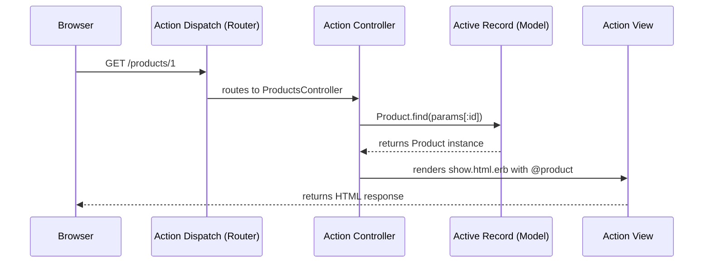

Rails organizes every application around the Model-View-Controller (MVC) architectural pattern. MVC separates an application into three distinct layers, each with a specific responsibility, making code easier to reason about, test, and maintain.

- **Model** — Manages the data and business logic of your application.
- **View** — Handles rendering responses in various formats (HTML, JSON, XML, etc.).
- **Controller** — Handles incoming requests, coordinates between models and views, and returns a response.

## How a request flows through Rails

When a user's browser sends an HTTP request to a Rails application, the following sequence occurs:



1. **Action Dispatch** receives the incoming HTTP request and parses the URL.
2. The **router** matches the path and HTTP method to a controller and action defined in `config/routes.rb`.
3. The **controller action** is invoked. It queries models and prepares data.
4. The **model** retrieves or persists data using the database.
5. The **view template** is rendered using data assigned by the controller.
6. The rendered HTML is returned to the browser as an HTTP response.

To get Rails to handle a request, you need at minimum: a **route**, a **controller action**, and a **view**.

## Model

<Tabs>
  <Tab title="Overview">
    The Model layer represents the domain model of your application — the entities and business rules. In Rails, database-backed model classes are derived from `ActiveRecord::Base` (accessed through `ApplicationRecord`). Active Record connects classes to relational database tables with almost zero configuration.

    Active Record uses naming conventions to establish the mapping automatically:
    - The class `Product` maps to the `products` table.
    - An attribute `name` in the table becomes a Ruby method on the model instance.

    Models can also be ordinary Ruby classes or implement interfaces provided by Active Model, without any database backing.
  </Tab>
  <Tab title="Example: Model class">
    When Rails generates a model, the class body is empty — Active Record queries the database schema at runtime and generates accessor methods for each column automatically:

    ```ruby
    # app/models/product.rb
    class Product < ApplicationRecord
    end
    ```

    Inspect detected columns from the Rails console:

    ```ruby
    Product.column_names
    # => ["id", "name", "created_at", "updated_at"]
    ```
  </Tab>
  <Tab title="Example: Validations">
    Active Record provides validations to ensure that data inserted into the database adheres to your rules. Validations run automatically during `create`, `update`, and `save` operations:

    ```ruby
    # app/models/product.rb
    class Product < ApplicationRecord
      validates :name, presence: true
    end
    ```

    If a validation fails, `save` returns `false` and the model collects descriptive error messages:

    ```ruby
    product = Product.new
    product.save
    # => false

    product.errors.full_messages
    # => ["Name can't be blank"]
    ```
  </Tab>
  <Tab title="Example: Querying">
    Active Record generates SQL queries from Ruby method calls, eliminating the need to write raw SQL for common operations:

    ```ruby
    # SELECT * FROM products
    Product.all

    # SELECT * FROM products WHERE name = 'Pants' LIMIT 11
    Product.where(name: "Pants")

    # SELECT * FROM products ORDER BY name ASC LIMIT 11
    Product.order(name: :asc)

    # SELECT * FROM products WHERE id = 1 LIMIT 1
    Product.find(1)
    ```

    `where` and `order` return an `ActiveRecord::Relation` — a chainable, Array-like collection of records.
  </Tab>
</Tabs>

### Database migrations

Changes to the database schema are managed through migrations — Ruby classes that describe modifications to the database in a reversible way. This ensures schema changes can be tracked in version control and safely deployed to any environment.

```ruby
# db/migrate/<timestamp>_create_products.rb
class CreateProducts < ActiveRecord::Migration[8.2]
  def change
    create_table :products do |t|
      t.string :name

      t.timestamps
    end
  end
end
```

`t.timestamps` adds `created_at` and `updated_at` columns. Active Record sets these automatically when records are created or updated.

Run pending migrations with:

```bash
$ bin/rails db:migrate
```

## View

<Tabs>
  <Tab title="Overview">
    The View layer is composed of templates that render the response returned to the client. In Rails, view generation is handled by **Action View**. The most common template format is ERB (Embedded Ruby) — HTML files with embedded Ruby code for dynamic content.

    Views live in `app/views/` in a folder named after their controller. The `ProductsController` looks for views in `app/views/products/`.

    Controllers share data with views using **instance variables** (variables starting with `@`). Any instance variable assigned in a controller action is automatically available in the corresponding view template.
  </Tab>
  <Tab title="Example: ERB template">
    ERB provides two tag styles:
    - `<%= %>` — evaluates Ruby and outputs the return value into the HTML.
    - `<% %>` — evaluates Ruby without outputting anything (useful for loops and conditionals).

    ```erb
    <%# app/views/products/index.html.erb %>
    <h1>Products</h1>

    <div id="products">
      <% @products.each do |product| %>
        <div>
          <%= link_to product.name, product_path(product.id) %>
        </div>
      <% end %>
    </div>
    ```

    `link_to` is an Action View helper that generates an HTML anchor tag. Route helpers like `product_path` generate the correct URL automatically.
  </Tab>
  <Tab title="Example: Partials">
    Partials are reusable view fragments. Their filenames start with an underscore. They are rendered using the `render` helper and accept local variables:

    ```erb
    <%# app/views/products/_form.html.erb %>
    <%= form_with model: product do |form| %>
      <% if form.object.errors.any? %>
        <p class="error"><%= form.object.errors.full_messages.first %></p>
      <% end %>

      <div>
        <%= form.label :name %>
        <%= form.text_field :name %>
      </div>

      <div>
        <%= form.submit %>
      </div>
    <% end %>
    ```

    Render the partial from a view, passing in local variables:

    ```erb
    <%# app/views/products/new.html.erb %>
    <h1>New product</h1>

    <%= render "form", product: @product %>
    <%= link_to "Cancel", products_path %>
    ```

    Using local variables (rather than instance variables) allows the same partial to be reused in multiple contexts on the same page.
  </Tab>
  <Tab title="Example: Route helpers">
    Rails generates URL helper methods for every named route. Run `bin/rails routes` to see route prefixes:

    ```
      Prefix Verb   URI Pattern             Controller#Action
    products GET    /products(.:format)     products#index
     product GET    /products/:id(.:format) products#show
    ```

    These prefixes map to helper methods:

    ```ruby
    products_path          # => "/products"
    products_url           # => "http://localhost:3000/products"
    product_path(1)        # => "/products/1"
    product_url(1)         # => "http://localhost:3000/products/1"
    ```

    `_path` helpers return a root-relative path. `_url` helpers return a full URL including the protocol and host, which is required for URLs embedded in emails.
  </Tab>
</Tabs>

## Controller

<Tabs>
  <Tab title="Overview">
    The Controller layer is responsible for handling incoming HTTP requests and returning a response. Controller classes are derived from `ActionController::Base` (accessed through `ApplicationController`). Each public method in a controller is an **action**.

    Incoming requests are routed to a controller and action by **Action Dispatch**, which parses the request URL and HTTP method against the rules defined in `config/routes.rb`.

    Controllers can return HTML, XML, JSON, and other formats. They load models, assign instance variables for views, and trigger rendering or redirects.
  </Tab>
  <Tab title="Example: Controller actions">
    A controller with full CRUD actions for the `Product` model:

    ```ruby
    # app/controllers/products_controller.rb
    class ProductsController < ApplicationController
      before_action :set_product, only: %i[ show edit update ]

      def index
        @products = Product.all
      end

      def show
      end

      def new
        @product = Product.new
      end

      def create
        @product = Product.new(product_params)
        if @product.save
          redirect_to @product
        else
          render :new, status: :unprocessable_entity
        end
      end

      def edit
      end

      def update
        if @product.update(product_params)
          redirect_to @product
        else
          render :edit, status: :unprocessable_entity
        end
      end

      private
        def set_product
          @product = Product.find(params[:id])
        end

        def product_params
          params.expect(product: [ :name ])
        end
    end
    ```
  </Tab>
  <Tab title="Example: Routing">
    Routes are defined in `config/routes.rb` using a Ruby DSL. A route pairs an HTTP method and URL path with a controller and action:

    ```ruby
    # config/routes.rb
    Rails.application.routes.draw do
      root "products#index"

      # Generates all 8 CRUD routes for products
      resources :products
    end
    ```

    Individual routes can also be defined explicitly:

    ```ruby
    # config/routes.rb
    Rails.application.routes.draw do
      get  "/products",     to: "products#index"
      post "/products",     to: "products#create"
      get  "/products/:id", to: "products#show"
    end
    ```

    The `:id` segment is a route parameter captured from the URL and available in the controller as `params[:id]`.
  </Tab>
  <Tab title="Example: Strong parameters">
    Controllers use strong parameters to filter incoming form data before passing it to models. This protects against mass assignment vulnerabilities:

    ```ruby
    # Only :name is permitted — any other submitted params are ignored
    def product_params
      params.expect(product: [ :name ])
    end
    ```

    Strong parameters are typically defined as private methods and called inside `create` and `update` actions:

    ```ruby
    def create
      @product = Product.new(product_params)
      if @product.save
        redirect_to @product
      else
        render :new, status: :unprocessable_entity
      end
    end
    ```
  </Tab>
</Tabs>

### Before actions

A `before_action` runs a method before one or more controller actions. It is commonly used to avoid repeating the same code across multiple actions — a direct application of the DRY principle:

```ruby
class ProductsController < ApplicationController
  before_action :set_product, only: %i[ show edit update ]

  def show
    # @product is already set by set_product
  end

  private
    def set_product
      @product = Product.find(params[:id])
    end
end
```

Without `before_action`, the `Product.find(params[:id])` call would need to be duplicated in `show`, `edit`, and `update`.

## Putting it together

The three layers interact in a clear, predictable sequence for every request. Here is a complete example of what happens when a user visits `/products/1`:

1. **Route:** `GET /products/1` matches `resources :products`, directing the request to `ProductsController#show`.
2. **Controller:** The `before_action` calls `set_product`, which runs `Product.find(1)` and assigns the result to `@product`.
3. **Model:** Active Record executes `SELECT "products".* FROM "products" WHERE "products"."id" = 1 LIMIT 1` and returns a `Product` instance.
4. **View:** Rails renders `app/views/products/show.html.erb` with `@product` available as a local binding.
5. **Response:** The rendered HTML is returned to the browser with an HTTP 200 status.

<Note>
  Each layer is designed to know as little as possible about the others. Controllers do not generate HTML directly; views do not query the database. This separation makes each layer independently testable and easier to change.
</Note>
